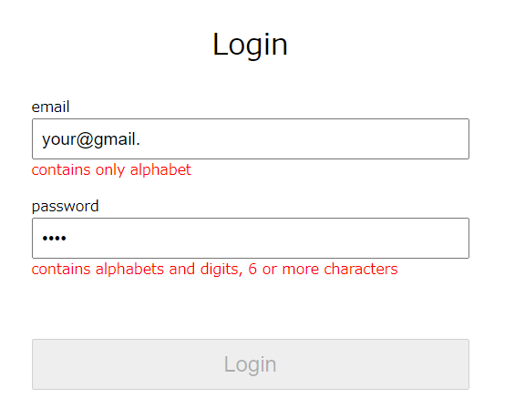
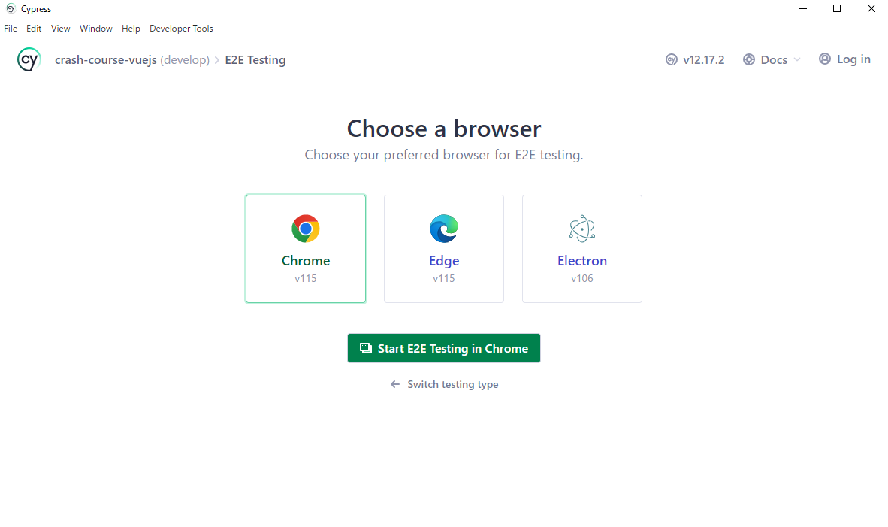

## Repository of TDD × Vue 3 crash course

This is a repository of what I explained in my [blog here](https://moritakuaki.com/first-step-view-with-tdd). From first commit to lastest, you can learn how to do TDD hands-on.

You can learn how to

- **Write unit test.**
- **Write component test.**
- **Write E2E test with actual server response.**

And I'll explain TDD using this teaching material, simplest Login Form :)

   

### Requirements

##### Environment of

- Nodejs >= v18
- Docker

##### knowledge of

- Elementary of typescript
- Elementary of docker
- Using javascript flamework (optional)

## How to run

#### Vue.js

Now you're supposed to have nodejs >= 18, download the modules by `npm install`
When download are finished, type `npm run dev` to run dev-server hosting Vue.js.

#### Server API

You can run server API, with `docker compose up` or `docker-compose up`.
I added ./server.yml for definition, but actual code is in ./server/server.js

## How to test

#### Unit + Component Tests

I use vitest for unit + component testing framework. All tests except E2E are running by `npx vitest` or `npm run test` commands.

If you are using [VS Code](https://code.visualstudio.com/) try this [Vitest](https://marketplace.visualstudio.com/items?itemName=ZixuanChen.vitest-explorer) extension and you can run test easily.

#### E2E Tests

E2E tests uses actual browser for test, and you cannot run only by command. Type `npm cypress:open` and brower has opened, and folloing the instruction (choose E2E)

   

## Recommended IDE Setup

- [VS Code](https://code.visualstudio.com/) + [Volar](https://marketplace.visualstudio.com/items?itemName=Vue.volar) (and disable Vetur) + [TypeScript Vue Plugin (Volar)](https://marketplace.visualstudio.com/items?itemName=Vue.vscode-typescript-vue-plugin) + [Vitest](https://marketplace.visualstudio.com/items?itemName=ZixuanChen.vitest-explorer)
